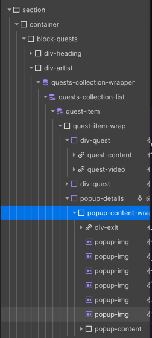
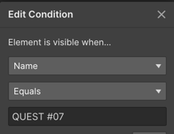

Deployment process 
=================

## Friday midday
Follow these steps to update the weekly assets, metadata, and smart contract for The Lost Wallet project:

### 1. Upload weekly assets
For week `n`, upload files in `assets` corresponding to MP4 files `n*2-1` and `n*2` on Pinata.

### 2. Update metadata 
In the /metadata directory, update the `(n*2-1).json` and `(n*2).json` files with the two new CIDs.

### 3. Generate new weekly metadata
Run the following command to generate the new weekly metadata files:

``` bash
/bin/bash ./split-in-weeks.sh
```

### 4. Upload corresponding folder to IPFS
from `/weeks/tlw-week-n` 

### 5. Update the contract
Run the activateWeek function with `n` as the new week:
https://etherscan.io/address/0x0E84aBd06A5Ce90313457F3225D6EAa2d6E999F9?method=Activate__Week~0xc87d4a28#writeContract#F1

Run the setURI function with the folder CID:
https://etherscan.io/address/0x0E84aBd06A5Ce90313457F`3225D6EAa2d6E999F9?method=Activate__Week~0xc87d4a28#writeContract#F10

ipfs://`ipfs_hash_of_metadata_folder`/{id}.json


### 6. Update the Front-end

1. Go to the Webflow code editor: https://webflow.com/dashboard/sites/the-lost-wallet-website/code
2. With `n` as the week number, increase the LAST_ACTIVATED_WEEK_ID:
``` js
    const LAST_ACTIVATED_WEEK_ID = n;
```


## Sunday 18h

### 1. Add new NFT in CMS
https://webflow.com/design/the-lost-wallet-website
In CMS go to quests, then select "Quest `n`" and fill following data
- Description = given description
- NFT Num = NFT `n`
  - should be preceded by 0 if `n` < 10
- Video = given youtube link
- Display = true

### 2. Add NFT asset video
Now you should go to `Quests` page to add NFT asset

Duplicate a "popup-image" in this folder


and replace video with "/assets/`2*n`.mp4"

In element settings, change the condition for "QUEST#`n`"



### 3. Change LAST_ACTIVATED_WEEK_ID

in site settings, custom code and look for
`const LAST_ACTIVATED_WEEK_ID = `n-1`;`

and change value to `n`


